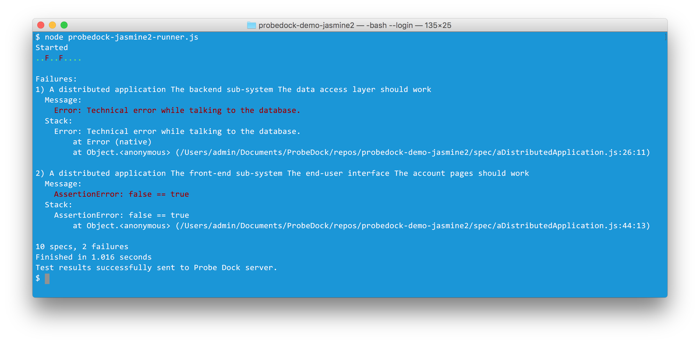
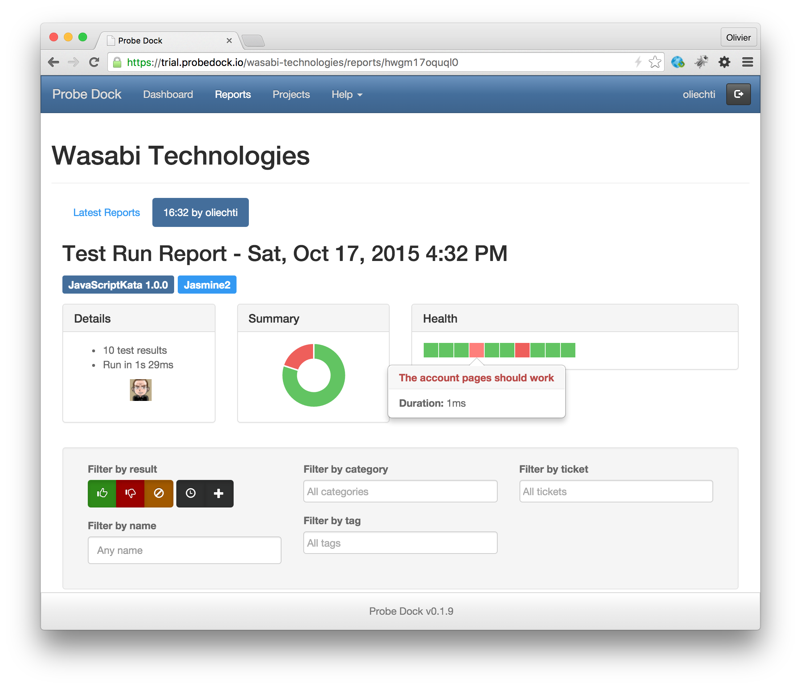
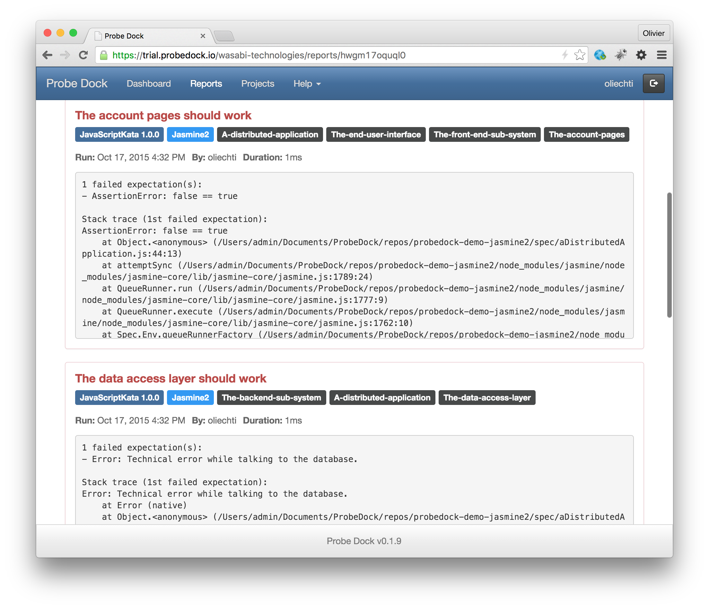
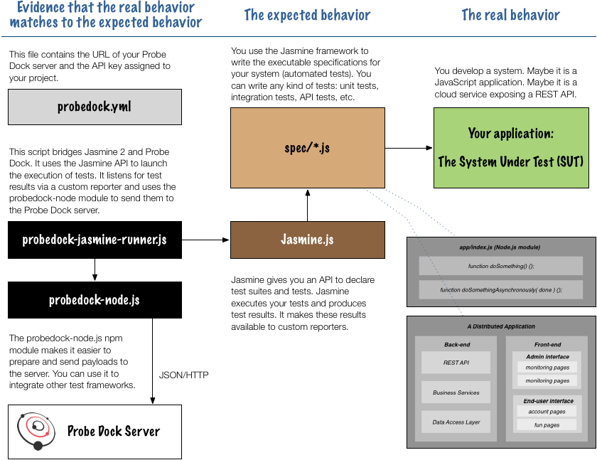

# probedock-demo-jasmine2

The code in this repo shows how to integrate Probe Dock with the last version (2.3) of the  [Jasmine](http://jasmine.github.io/) JavaScript testing framework. 


The solution uses our **generic [probedock-node](https://www.npmjs.com/package/probedock-node) npm module**. We have then written a script that launches the execution of the scripts by Jasmine and that receives test results via a custom reporter. The script then uses the Probe Dock node library to send the results to the Probe Dock server.

## TL;DR

If you want to see the tool in action, proceed as follows:

1. Make sure that you have **access to a Probe Dock server**. From it web interface, create a new project and grab its API key. If you don't have any Probe Dock server yet, visit [the trial server](https://trial.probedock.io) for a free account and have a look at [this](http://probedock.io/getting-started/) page. Follow the instructions and make sure that you create a file in your home directory (`~/.probedock/config.yml`), in which you provide your server credentials.

2. Edit the `probedock.yml` file and enter the URL of your Probe Dock server and the API key of your project.

3. Execute the following command (with 2 expected errors):

```
$ node probedock-jasmine2-runner.js 
```

You should get the following output on the console:



Finally, check the results on the Probe Dock server:





## Overview

An overview of the system is shown below. The diagram shows that:

* On the right side, you have **a system that you want to test**. Maybe it is a Node.js module, for which you would like to write unit tests. But maybe it is system implemented in another language, for which you would like to write API tests or UI-level tests. In this repo, we have an example for each of these scenarios. In any case, on the right side you have **something that has an actual behavior**.

* In the middle, you have an **executable specification**, which consists of a collection of test suites, which contains collections of automated tests. You use the **Jasmine API** to write these test suites in Javascript files. Later on, you tell Jasmine to execute them. In the middle, **you specify the expected behavior of your system**.

* On the left side, you have the components that **trigger the execution of the tests**, that **collect the results** and that **send them to the Probe Dock server** where the team can analyze them. The probedock-jasmine2-runner script uses the jasmine npm module to programmatically control Jasmine: it launches the runner and listens for test result events via a custom report. The probedock-jasmine2-runner script also uses the probedock-node npm module. **In the end, you have a way to check if the actual behavior of your system corresponds to its intended behavior**.




## Implementation

### How do we execute tests with Jasmine?

As mentioned earlier, there are different ways to launch Mocha. Some developers install the `jasmine` executable from the command line and they see test results on the console. Other developers use a third-party plugin in their build system (grunt, gulp, etc.), so that tests are executed by the build pipeline. The authors of these plugins have used the API provided by Jasmine, very much like we have done.

In our solution, you execute the tests by running the probedock-jasmine2-runner.js script, which we have implemented. The first thing that we do in this script is to import the jasmine module, specify where our test files are located and tell Jasmine to execute the tests. The following code is not exactly what you will find in the script, but it captures the essence of the previous operations:

```
var Jasmine = require('jasmine');
var jasmine = new Jasmine();

jasmine.loadConfig({
	spec_dir: 'spec',
	spec_files: ['**/*.js'],
	helpers: ['helpers/**/*.js']
});

...

jasmine.execute();
```

### How do we get test results from Jasmine?

With Jasmine 2, if you want to get the test results (successes and failures), you can write a [custom reporter](http://jasmine.github.io/2.3/custom_reporter.html). Essentially, you register callback functions on events that are fired when the whole test run starts, when a test suite is encountered, when the execution of a test starts, when the result of a test is available, etc. With this interface, it is easy to notify the Probe Dock client and to prepare the test metadata. The most important callback is entitled specDone and is called when a test result is available. If you look at our script, you will find this code (some of the details have been removed from this excerpt).

```
var probedockReporter = {
...
	specDone: function(result) {
		var metadata = getTestMetadataForProbeDock(result, this.context);
		if (result.failedExpectations.length === 0) {
			probeDockTestRun.add(null, metadata.name, true, duration, {
				tags: metadata.tags
			});
		} else {
			probeDockTestRun.add(null, metadata.name, false, duration, {
				tags: metadata.tags,
				message: metadata.message,
			});
		}
	}
};
```

### How do I send test results to the Probe Dock server?

In order to send the test results to Probe Dock, the following operations must be performed:

1. Import the probedock-node module and get a reference to the **client** object.
2. **Load the configuration** (from the probedock.yml file), which contain the project key and the URL of the Probe Dock server.
3. Tell the client that **the test run has started**.
4. Ask Jasmine to execute the tests and subscribe to its events.
5. For each passed and failed test, tell the probedock client to **add a result**.
6. When all tests have been run, tell probedock to **end the test run**.
7. Optionally **save** the probedock payload in a local file.
8. Tell the probedock client to **send the payload** to the server.


## Contributing

* [Fork](https://help.github.com/articles/fork-a-repo)
* Create a topic branch - `git checkout -b my_feature`
* Push to your branch - `git push origin my_feature`
* Create a [pull request](http://help.github.com/pull-requests/) from your branch

Please add a [changelog](CHANGELOG.md) entry with your name for new features and bug fixes.

## License

This sofotware is licensed under the [MIT License](http://opensource.org/licenses/MIT).
See [LICENSE.txt](LICENSE.txt) for the full license.

